<div align="center">
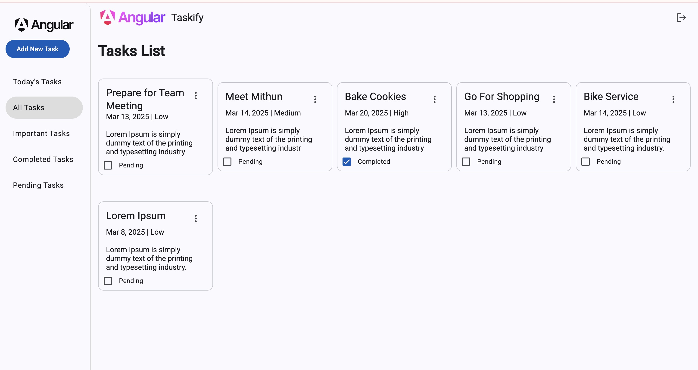
</div>

## 📝 Table of Contents

- [📝 Table of Contents](#-table-of-contents)
- [📙 About ](#-about-)
- [🌠 Features ](#-features-)
- [📂 Folder Structure ](#-folder-structure-)
  - [Backend ](#backend-)
  - [FrontEnd : Angular ](#frontend-)
  - [Running ](#running-)
- [🏁 Getting Started ](#-getting-started-)
  - [Prerequisite ](#prerequisite-)
  - [Installation ](#installation-)
  - [Running ](#running-)
- [📸 Demo Screens ](#-demo-screens-)
- [⏳ Backlog](#-backlog)

## 📙 About <a name = "about"></a>

A to do List application that allows users to create and manage their tasks. It provides a simple and intuitive interface for users to add, edit, delete, and complete tasks.


## 🌠 Features <a name= "features"></a>
1. Ability to add new tasks.
2. Ability to view tasks based on different categories, **_such as_** 
   - Today's Tasks
   - All Tasks
   - Important Tasks
   -  Completed Tasks
   -  Pending Tasks
3. Ability to mark tasks as **completed** or **uncompleted**.
4. Ability to edit and delete tasks.


## 📂 Folder Structure Backend <a name= "backend"></a>

```sh
/taskify-mean/server
└── src
   ├── middleware
   ├── routes
   ├── schemas
   ├── swagger
   └── utils

directory: 6
```
## 📂 Folder Structure Frontend (Angular) <a name= "frontend"></a>

```sh
/taskify-mean/taskify-ui
└── src
   ├── app
   |  ├── components
   |  |  └── auth
   |  |     ├── signin
   |  |     └── signup
   |  ├── interceptors 
   |  ├── modules
   |  |  └── tasks
   |  |     ├── components
   |  |     |  ├── task-form
   |  |     |  └── task-list
   |  |     ├── interfaces
   |  |     └── services
   |  └── shared
   |     ├── components
   |     |  ├── navigation-toolbar
   |     |  └── page-not-found
   |     ├── constants
   |     └── utils
   └── environments

directory: 22
```
## 🏁 Getting Started <a name = "get-started"></a>

> This is an list of needed instructions to set up your project locally, to get a local copy up and running follow these
> instructuins.

### Prerequisite <a name = "req"></a>

1. Node.js

### Installation <a name = "Install"></a>

1. **_Clone the repository_**

```sh
$ git clone https://github.com/mohan-mu/taskify-mean.git
```

2. **_Navigate to taskify-mean Folder_**

```sh
$ cd taskify-mean
```

### Running <a name = "running"></a>

**_Running program_**

1. **_Install modules_**

```sh
npm install && cd server && npm i && cd .. && cd taskify-ui && npm i
```
2. **_Start program_**

```sh
// Make sure you update the .env File with right values
npm start
```

## 📸 Demo Screens <a name = "screens"></a>


<div align="center">
<h3 align='left'>Swagger UI </h3>
   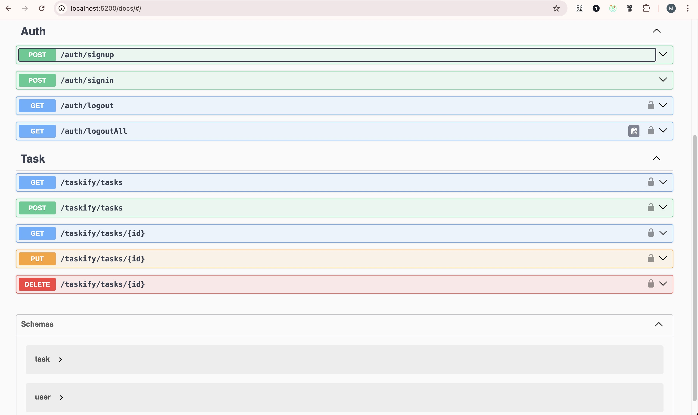
<h3 align='left'>All Tasks</h3>
   
   <hr/>
   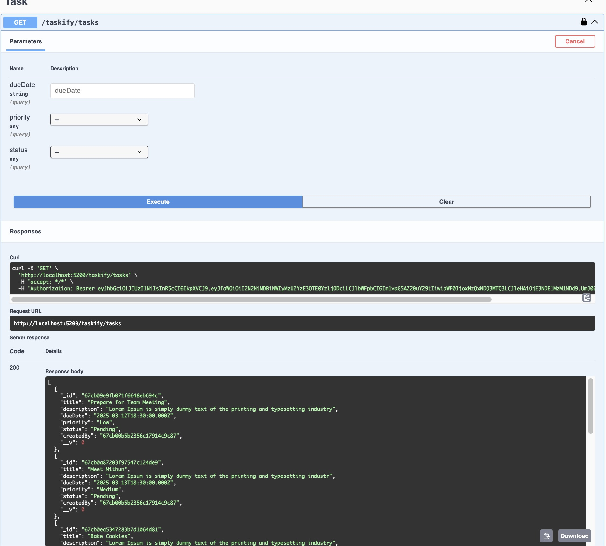
<h3 align='left'>Today's Tasks</h3>
   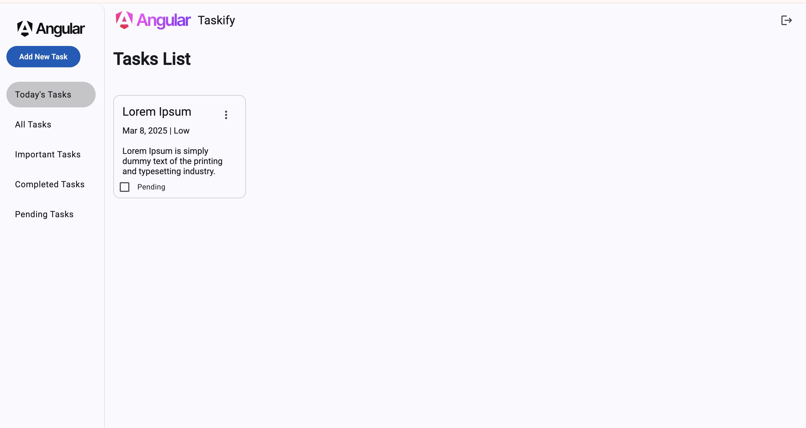
 <hr/>
   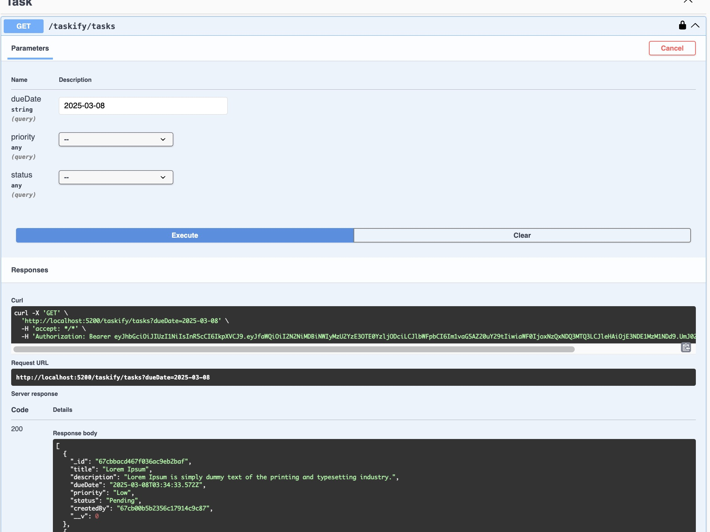
<h3 align='left'>Important Tasks</h3>
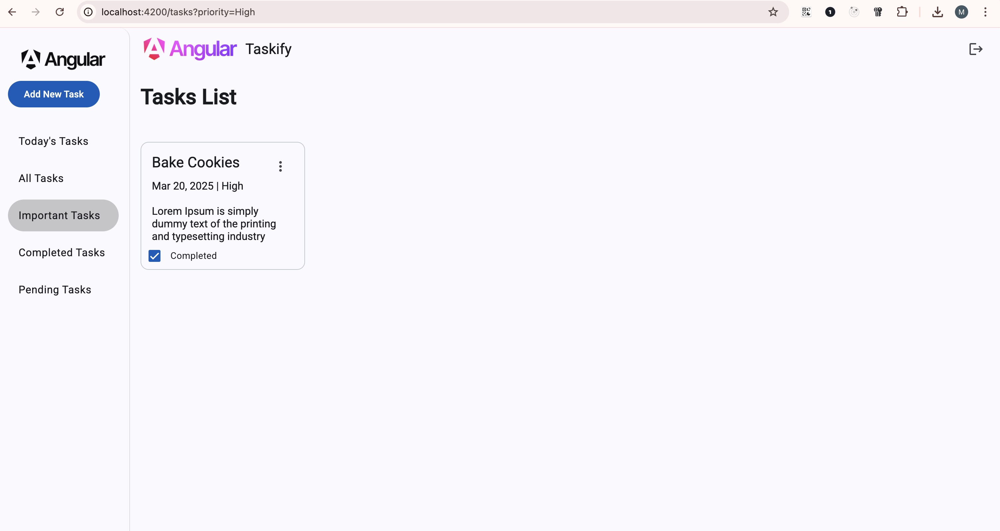
   <hr/>
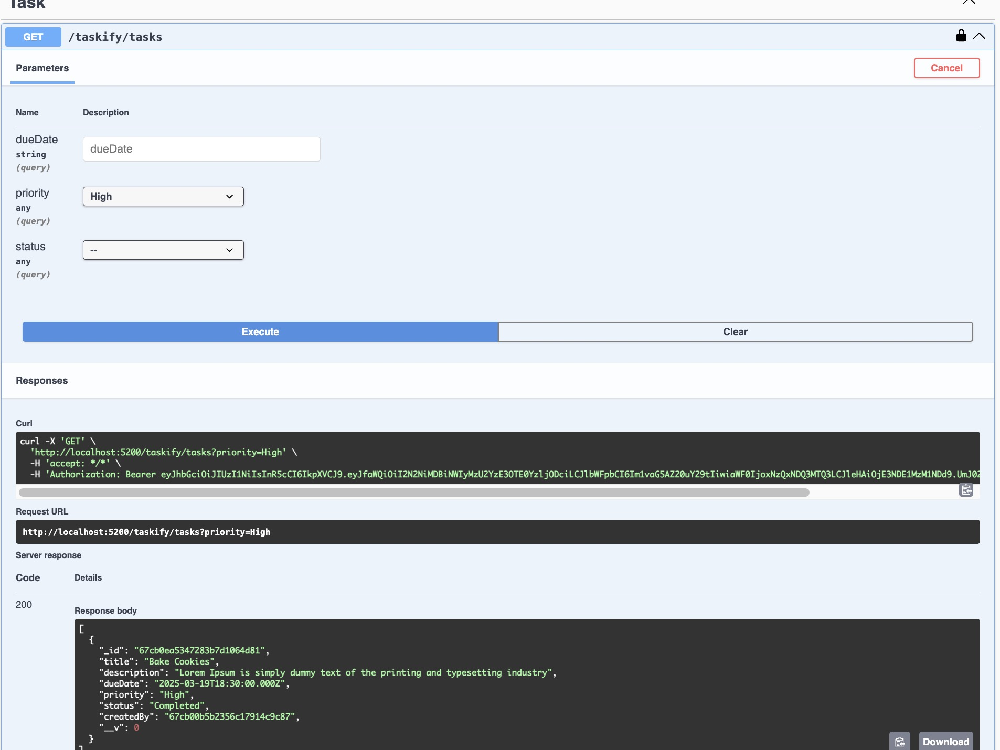
<h3 align='left'>Completed Tasks</h3>
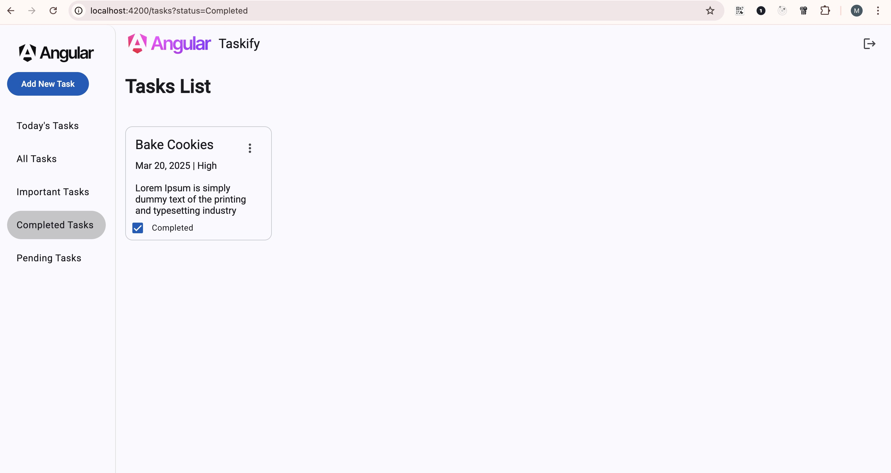

<h3 align='left'>Add task</h3>
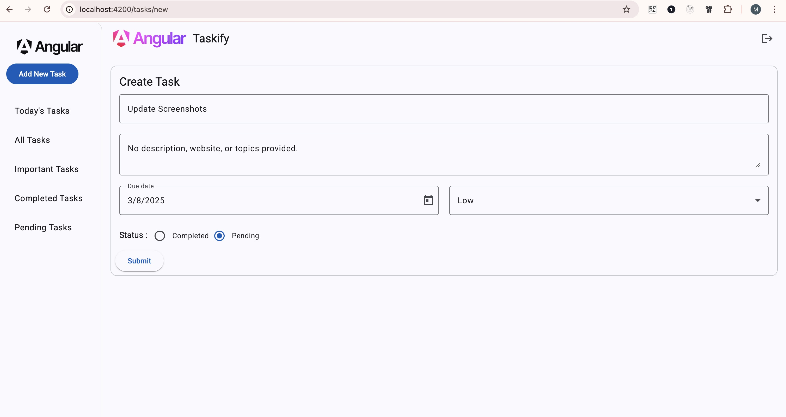
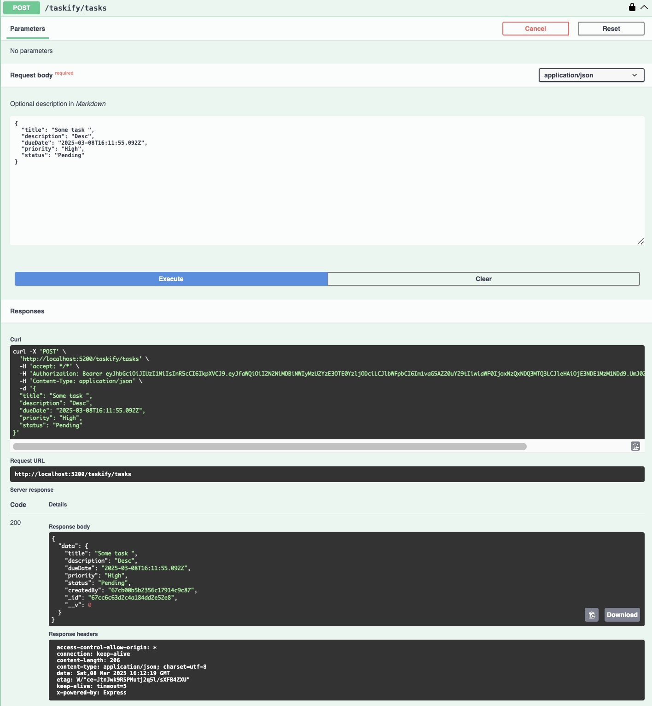
<h3 align='left'>Edit task</h3>
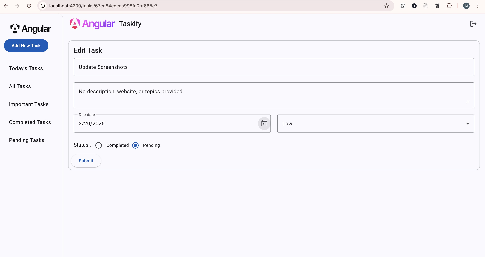
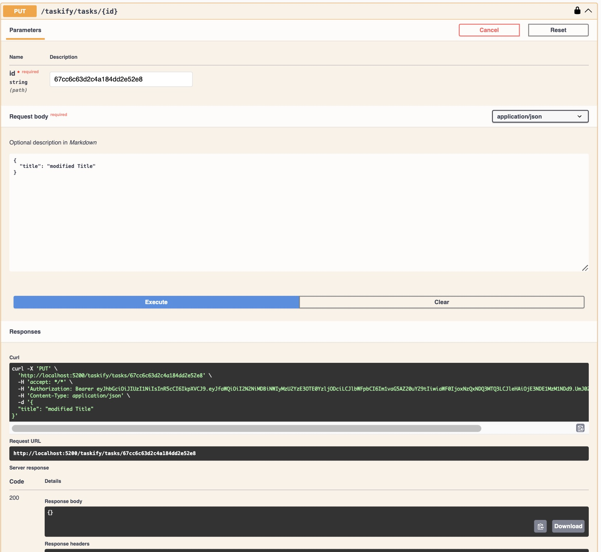
<h3 align='left'>Delete task</h3>
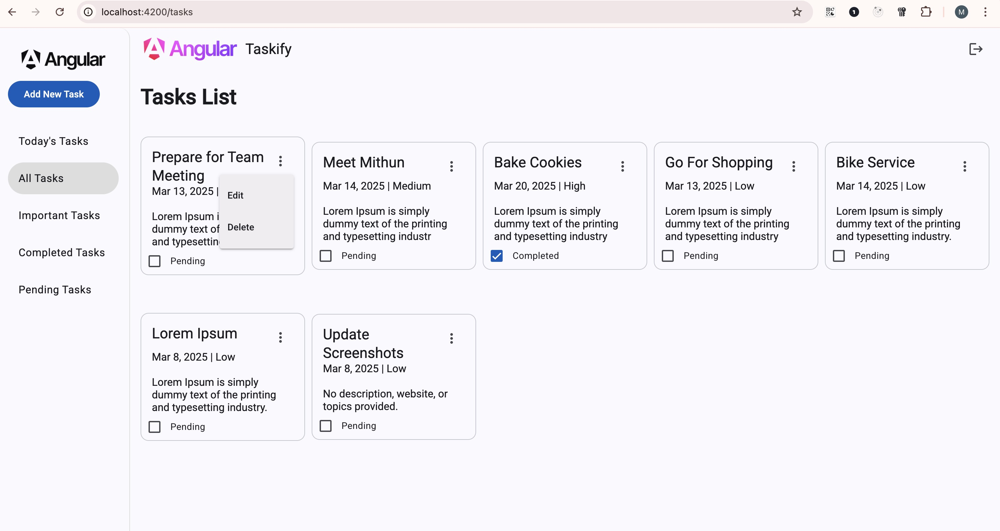
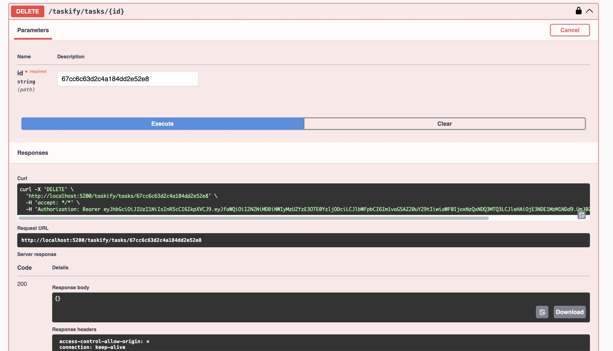
<h3 align='left'>Auth Sign In</h3>
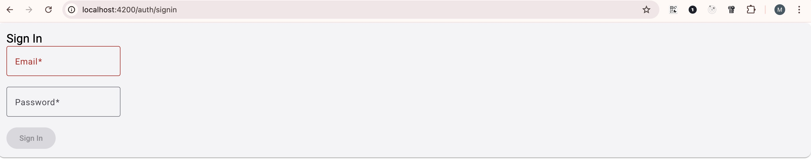
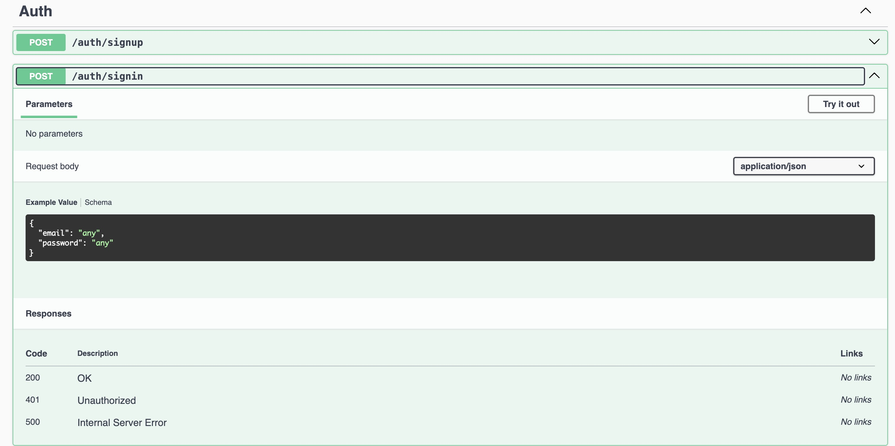
<h3 align='left'>Auth Sign up</h3>
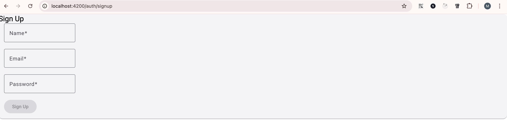
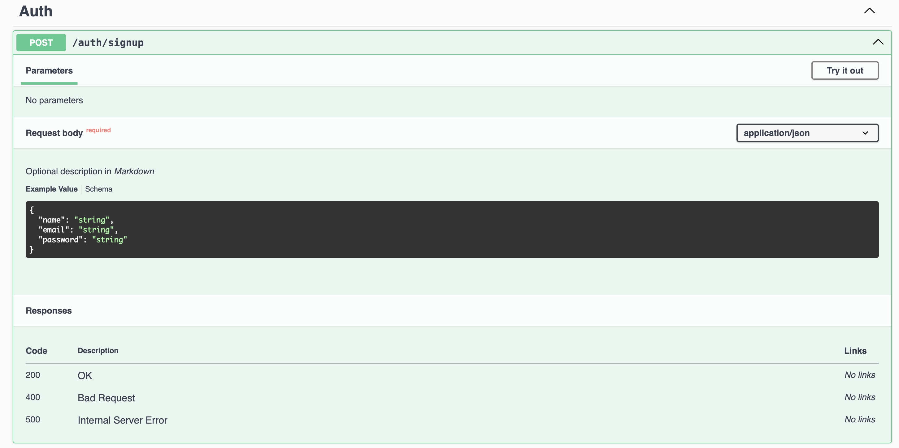
</div>
    
  </tr>
 </table>

 ## ⏳ Backlog
 - [x] ~~Add a feature to categorize tasks, allowing users to filter tasks by category.~~

 - [x] ~~Add the ability to sort tasks by various criteria, such as due date, priority, or category.~~ 

 - [x] ~~Add the ability to prioritize tasks by assigning them different levels of importance or urgency.~~

 - [x] ~~Implement authentication and authorization features to allow users to create and manage their own tasks.~~
 - [x] ~~Ability to filter tasks by status (all, active, completed).~~
 - [x] ~~Ability to edit task details.~~ 
  - [x] ~~Partially Done : Add Tests~~ 
 - [] Explore WebSockets

